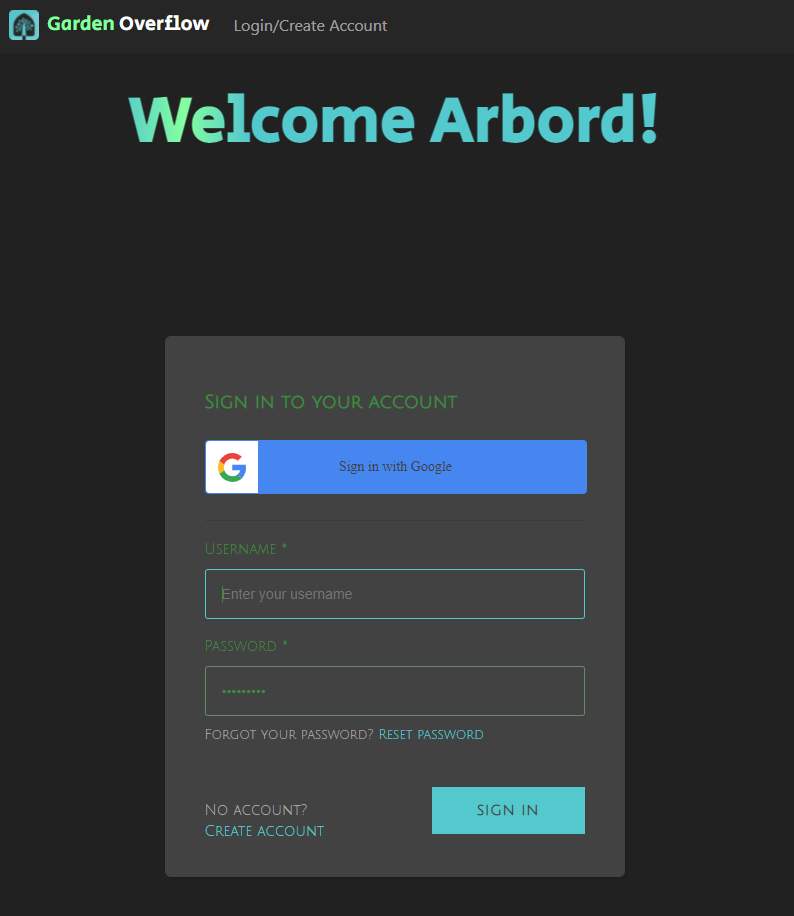
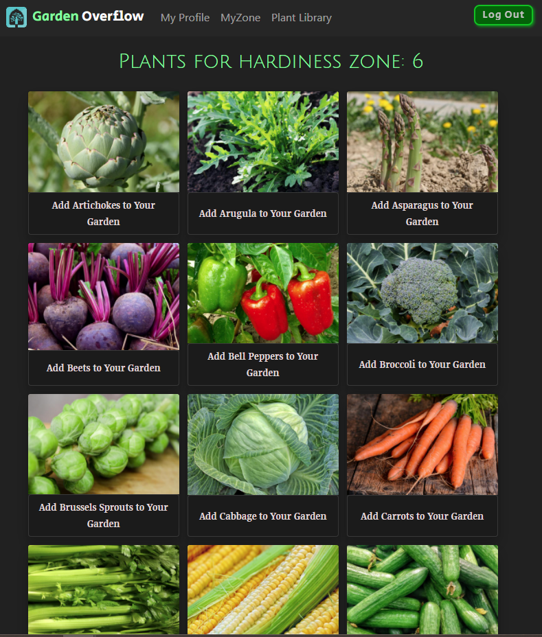
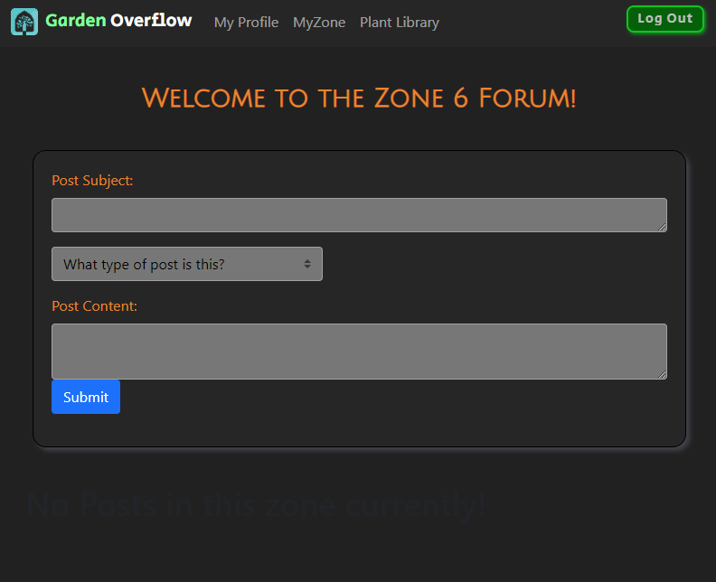

# Garden Overflow

## Table of Contents

* [Description](#description)
* [Features](#features)
* [Installation](#installation)
* [Contributions](#contributions)
* [Images](#images)
* [Links](#links)

# Description

Garden Overflow allows a user to enroll for an account and create an online garden made up of plants that grow well in their hardiness zone. It allows users to post to their zone and make comments to questions other users may have.

# Features

Garden Overflow uses a base of react with mongodb as our database. It utilizes AWS Amplify and Cognito to enroll and signin and out. The data was scraped using Parse Hub to create a larger data base. 

# Installation

After cloning the repository run "npm i" to ensure you have all of the packages. Be sure you've created your local database, we used MongoDB Compass. 

# Contributions 

If you're interested in making a contribution please select Ariana Winters to review your pull requests. You will receive a response within 24 hours. 

# Images

Signin

Plant Library

Zone Forum

# Links

- Repository: https://github.com/arianaw15/Garden-Overflow
- Homepage: https://garden-overflow.herokuapp.com/

